# FinSight - UPI Transaction Intelligence App

FinSight is an AI-powered financial intelligence mobile application built with Flutter. It automatically reads bank transaction SMS messages, converts them into structured data, categorizes expenses using machine learning, monitors budgets in real time, and predicts UPI transaction failures based on historical patterns.

Unlike traditional expense trackers that require manual entry, FinSight works automatically in the background and delivers real-time financial insights with zero user effort.

---

## Table of Contents

- [Overview](#overview)
- [System Architecture](#system-architecture)
- [How the App Works](#how-the-app-works)
  - [1. Data Collection Layer](#1-data-collection-layer)
  - [2. Transaction Processing Engine](#2-transaction-processing-engine)
  - [3. Local Database Storage](#3-local-database-storage)
  - [4. Automatic Expense Categorization](#4-automatic-expense-categorization)
  - [5. Budget Monitoring System](#5-budget-monitoring-system)
  - [6. UPI Transaction Failure Prediction](#6-upi-transaction-failure-prediction)
  - [7. Financial Analytics Dashboard](#7-financial-analytics-dashboard)
- [Key Features](#key-features)
- [Technology Stack](#technology-stack)
- [App Screenshots](#app-screenshots)
- [What Makes This Project Unique](#what-makes-this-project-unique)
- [Installation](#installation)
- [Future Improvements](#future-improvements)

---

## Overview

FinSight solves a core problem: most users have no clear picture of where their money goes after UPI payments.

The application captures every UPI transaction from bank SMS notifications, processes it with NLP, stores it in a local database, and surfaces actionable insights through a clean, real-time dashboard.

The project covers the full data lifecycle — from raw SMS text to structured analytics, ML-based categorization, budget alerts, and failure prediction.

---

## System Architecture

```
SMS Collection Layer
        |
        v
NLP Processing Engine
        |
        v
Transaction Database (Hive - Local NoSQL)
        |
        v
Machine Learning Models
   |              |
   v              v
Expense      Failure
Categorization  Prediction
        |
        v
Budget Monitoring Engine
        |
        v
Flutter Frontend Dashboard
```

The architecture follows a clean layered design:

| Layer | Responsibility |
|---|---|
| SMS Collection | Reads and filters incoming bank SMS with user permission |
| NLP Engine | Parses raw SMS text into structured transaction data |
| Hive Database | Stores all transaction records offline |
| ML Models | Categorizes expenses and predicts failure probability |
| Budget Engine | Tracks spending against user-defined limits and triggers alerts |
| Flutter UI | Renders the dashboard, analytics, and AI Chat interface |

---

## How the App Works

### 1. Data Collection Layer

The app reads incoming SMS messages from the device (with explicit user permission) and filters only UPI-related bank notifications.

**Process:**

1. The app requests SMS read permission from the user.
2. It listens for incoming SMS messages in the background.
3. It filters only messages that match UPI transaction patterns.
4. Relevant messages are forwarded to the NLP processing engine.

**Extracted Data Fields:**

| Field | Example |
|---|---|
| Transaction Amount | Rs. 350 |
| Date and Time | 12 Jan, 14:22 |
| Transaction Status | Success / Failed |
| Bank Name | HDFC Bank |
| UPI Reference ID | 123456789 |
| Merchant Name | Amazon |

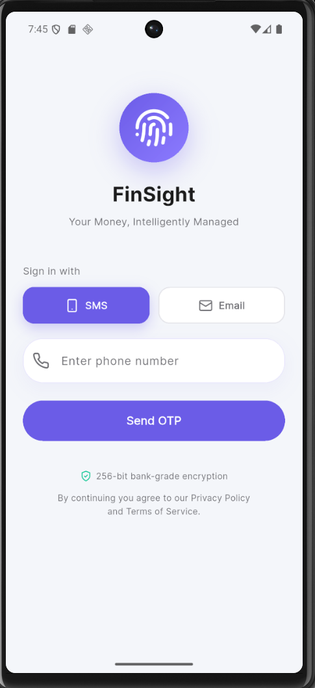

---

### 2. Transaction Processing Engine

Raw SMS text is cleaned and parsed using Natural Language Processing to extract structured transaction data.

**Processing Steps:**

1. **Text Cleaning** - Removes noise characters and normalizes formatting.
2. **Entity Extraction** - Identifies amount, merchant, bank, timestamp, and status.
3. **Data Structuring** - Converts extracted fields into a typed data object.

**Example:**

Input SMS:
```
Rs. 350 paid via UPI to Amazon on 12 Jan at 14:22. Ref No: 123456.
```

Structured Output:
```json
{
  "amount": 350,
  "merchant": "Amazon",
  "date": "12 Jan",
  "time": "14:22",
  "bank": "HDFC",
  "status": "Success",
  "ref_id": "123456"
}
```

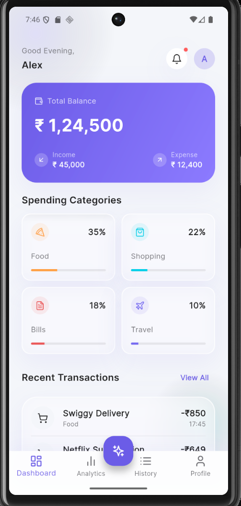

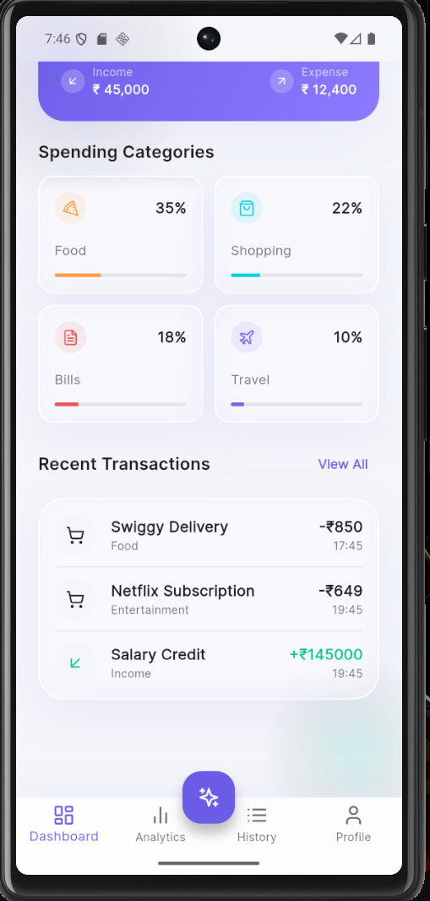

---

### 3. Local Database Storage

All structured transaction records are persisted locally using the Hive NoSQL database.

**Why Hive:**

| Reason | Detail |
|---|---|
| Lightweight | Minimal overhead on mobile devices |
| Fast | Binary key-value storage with fast read/write |
| Offline-First | No internet required to access data |
| Flutter Native | Built specifically for Dart/Flutter |

**Transaction Data Model:**

```
Transaction
-----------
id            String
amount        double
merchant      String
bank          String
date          DateTime
status        String  (Success / Failed)
category      String
refId         String
```

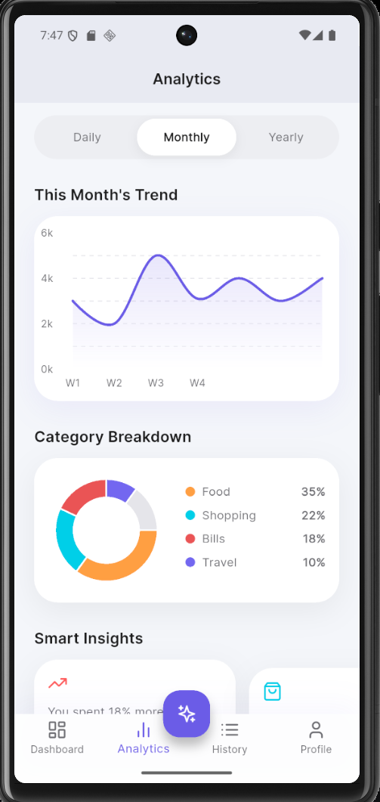

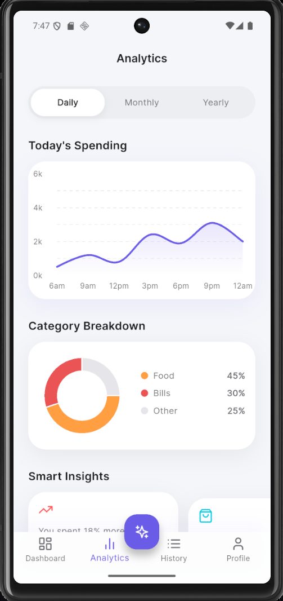

---

### 4. Automatic Expense Categorization

Every transaction is automatically classified into one of the following spending categories using a machine learning model.

**Categories:**

- Food
- Travel
- Shopping
- Bills
- Entertainment
- Others

**How it Works:**

The classification model is trained on transaction descriptions and merchant names. It uses keyword patterns and learned associations to determine the correct category.

**Example Mappings:**

| Merchant | Category |
|---|---|
| Swiggy | Food |
| Zomato | Food |
| Uber | Travel |
| Rapido | Travel |
| Amazon | Shopping |
| Flipkart | Shopping |
| Netflix | Entertainment |
| BESCOM | Bills |

No manual tagging is required. Every new transaction is categorized immediately upon capture.

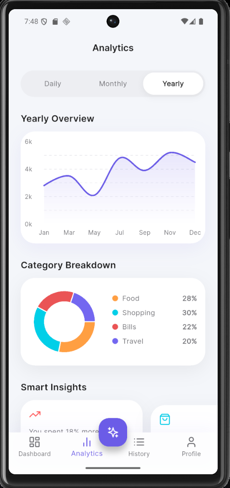

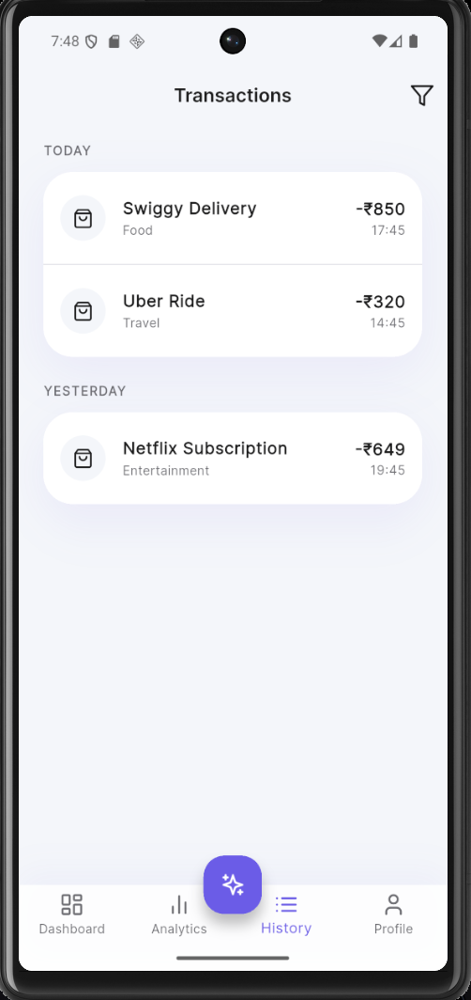

---

### 5. Budget Monitoring System

Users define spending limits per month and per category. The system continuously monitors actual spending and triggers smart alerts.

**Budget Setup:**

Users can set:
- A total monthly spending limit.
- Individual limits for each expense category.

**Example Configuration:**

```
Monthly Budget   : Rs. 20,000
Food Budget      : Rs. 5,000
Travel Budget    : Rs. 3,000
Shopping Budget  : Rs. 7,000
```

**Alert Logic:**

| Threshold | Alert Type |
|---|---|
| 80% of budget reached | Budget Warning Alert |
| 100% of budget reached | Budget Exceeded Alert |

The monitoring engine recalculates spending totals after every new transaction to keep alerts real time.

---

### 6. UPI Transaction Failure Prediction

FinSight includes a predictive model that analyzes historical transaction data to estimate the probability of a UPI transaction failing.

**Factors Used in Prediction:**

| Factor | Description |
|---|---|
| Transaction Time | Certain hours have higher bank server load |
| Bank Patterns | Some banks have recurring downtime windows |
| Transaction Amount | High-value transactions have different failure rates |
| Transaction Frequency | Rapid repeated transactions increase failure risk |
| Historical Failure Records | Past failed transactions inform future predictions |

**Model Output:**

The model returns a failure probability score between 0 and 1.

```
Failure Probability = 0.72  (72%)
```

If the probability crosses a defined threshold, the user receives a warning before attempting the transaction.

**Alert Example:**

```
High probability of UPI transaction failure detected at this time.
Consider retrying after some time or using a different bank.
```

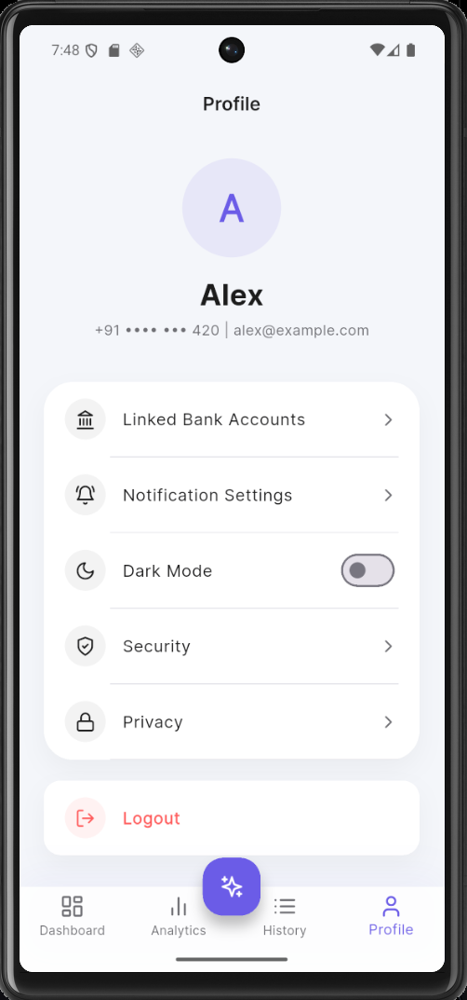

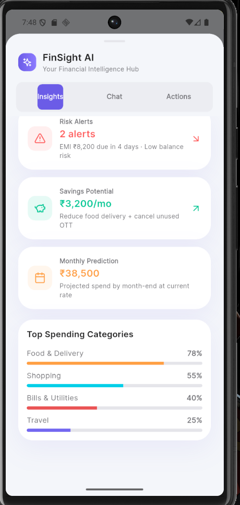

---

### 7. Financial Analytics Dashboard

The analytics module renders visual summaries of the user's financial activity.

**Dashboard Panels:**

| Panel | Content |
|---|---|
| Balance Overview | Total income vs total expenses |
| Category Breakdown | Spending distribution by category (donut chart) |
| Monthly Trend | Spending over time (line/bar chart) |
| Recent Transactions | Latest UPI transactions with status |

Charts update automatically as new transactions are captured, giving users a live view of their financial health.

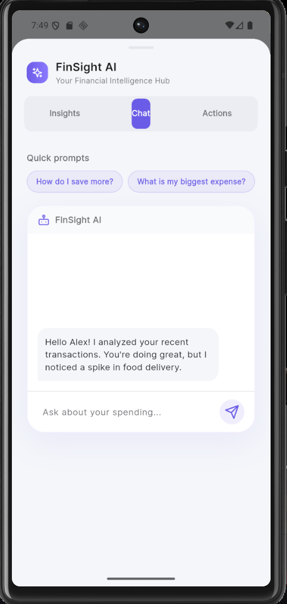

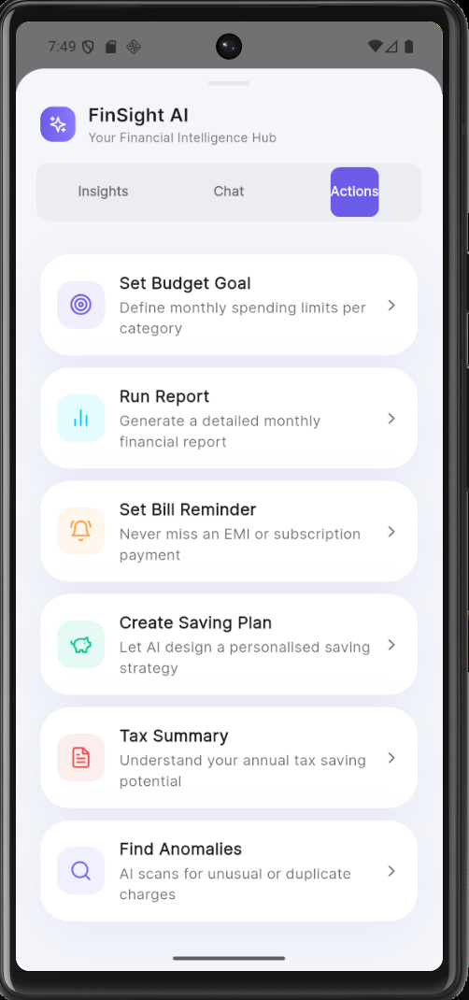

## Live Application Preview

| Dashboard | SMS Import (V2) | Add Transaction |
|---|---|---|
| 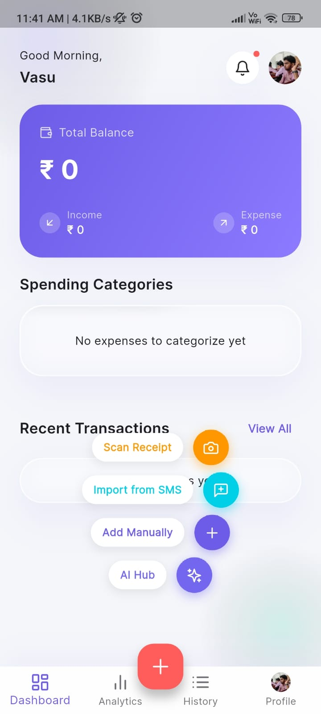 | 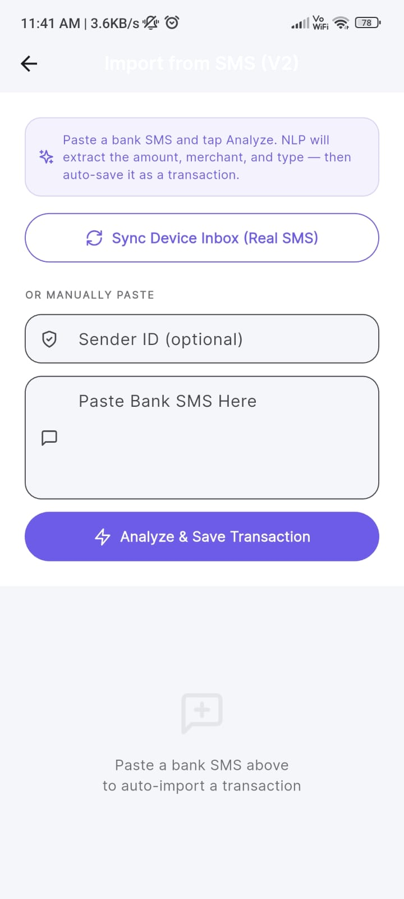 | 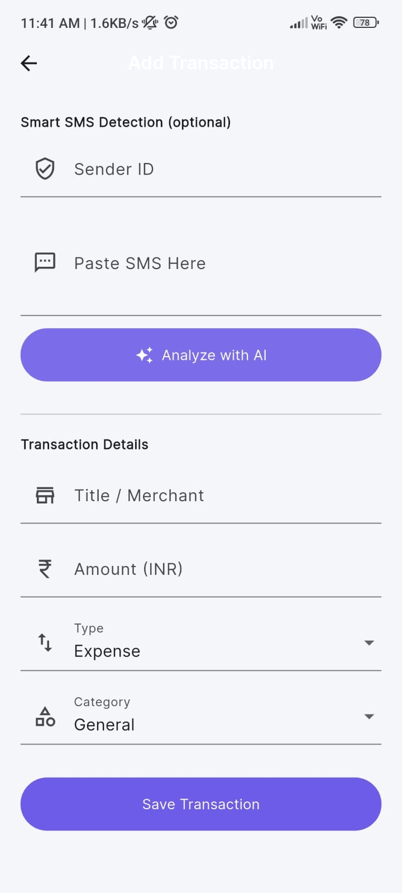 |

- **Real-time Dashboard**: A comprehensive overview of your financial status, including total balance, income, and categorized expenses.
- **Smart SMS Import (V2)**: Automatically extract transaction details from your bank's SMS notifications for seamless tracking.
- **AI-Powered Transaction Entry**: Manually add transactions or use AI-powered SMS detection to quickly record your spending.

---

## Key Features

- Automatic UPI transaction monitoring from bank SMS
- Machine learning expense categorization
- Budget monitoring with real-time alerts
- UPI transaction failure prediction
- Interactive financial analytics dashboard
- Offline-first architecture using Hive
- AI-powered financial chat interface
- Dark mode support

---

## Technology Stack

| Layer | Technology |
|---|---|
| Frontend | Flutter (Dart) |
| State Management | Riverpod |
| Local Database | Hive (NoSQL) |
| ML - Categorization | Transaction classification model |
| ML - Failure Prediction | Historical pattern analysis model |
| NLP / SMS Parsing | Custom NLP engine |

---

## App Screenshots

| Login | Dashboard | Transactions |
|---|---|---|
|  |  |  |

| Analytics | AI Center | Profile |
|---|---|---|
|  |  |  |

---

## What Makes This Project Unique

Most financial apps on the market require manual expense entry and focus only on basic tracking.

FinSight is different in three key ways:

**1. Fully Automated Data Capture**
Transactions are captured from SMS automatically. No manual entry. No linking bank accounts through third-party APIs.

**2. Predictive Intelligence**
Beyond tracking what has already happened, FinSight predicts what may go wrong next — specifically UPI transaction failures — giving users a proactive advantage.

**3. Offline First**
All data processing, storage, and analytics happen on-device. The app is fully functional without an internet connection.

---

## Installation

### Prerequisites

- Flutter SDK 3.x or higher
- Android SDK (for Android builds)
- Dart 3.x

### Steps

```bash
# Clone the repository
git clone https://github.com/Godwin-Sajeev/FinSight.git

# Navigate to project directory
cd FinSight

# Install dependencies
flutter pub get

# Run code generation (for Hive models)
dart run build_runner build

# Run the application
flutter run
```

### Permissions Required

The app requests the following permissions at runtime:

| Permission | Purpose |
|---|---|
| READ_SMS | Read UPI transaction SMS messages |
| RECEIVE_SMS | Listen for new incoming transactions |
| POST_NOTIFICATIONS | Deliver budget alerts and failure warnings |

---

## Future Improvements

| Feature | Description |
|---|---|
| Bank API Integration | Direct account linking for real-time balance sync |
| Credit Score Analysis | Track and visualize credit score trends |
| Smart Saving Recommendations | AI suggestions based on spending patterns |
| Investment Suggestions | Basic portfolio recommendations |
| Cloud Backup | Encrypted cloud sync across devices |
| Multi-language Support | Regional language SMS parsing |

---

## Developer

**Godwin Sajeev**
GitHub: [Godwin-Sajeev](https://github.com/Godwin-Sajeev)

---

*FinSight — Automated UPI Transaction Intelligence*
